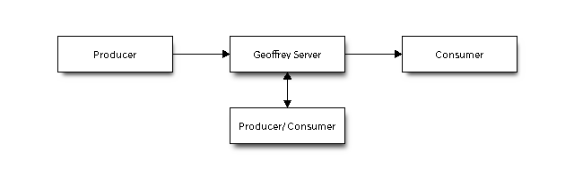
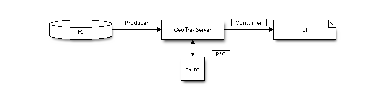

.. todo:: Traducir

Arquitectura
============

El diseño de Geoffrey ofrece una arquitectura flexible, que pretende hacer
posible desde pequeños despliegues para un sólo a usuario hasta despliegues
más complejos con la interacción de múltiples usuarios y procesos automáticos.

El modelo abstracto es el que sigue:

El elemento central que siempre está presente es `Geoffrey Server` que actua
como hub.

A dicho hub se pueden conectar otros elementos con distintos roles:

* Productores: Producen eventos.
* Consumidores: Consumen eventos.
* Productores/Consumidores: Consumen eventos y eventualmente los producen.

El ejemplo concreto más sencillo podría ser el siguiente:

1. En este caso el sistema de ficheros `FS` actua como **Productor**, producirá un
   evento cada vez que un fichero se abra, modifique, cierre, etc.
2. PyLint actuaría como **Productor/Consumidor** ya que bajo ciertos eventos
   producidos por `FS` ejecutará el proceso pylint y generará ciertos eventos
   como resultado de parsear la salida del comando.
3. El interfaz de usuario `UI` en este caso es un **Consumidor** puro, ya que
   recibirá los eventos y los mostrará al usuario.

Futuro
------

En un futuro, en arquitecturas más complejas será posible conectar
`Geoffrey Servers` entre si de modo que cada uno será **Productor/Consumidor**
del otro. Dado a equipos de desarrollo la posibilidad de ver en tiempo real
el resultado del trabajo colectivo.
